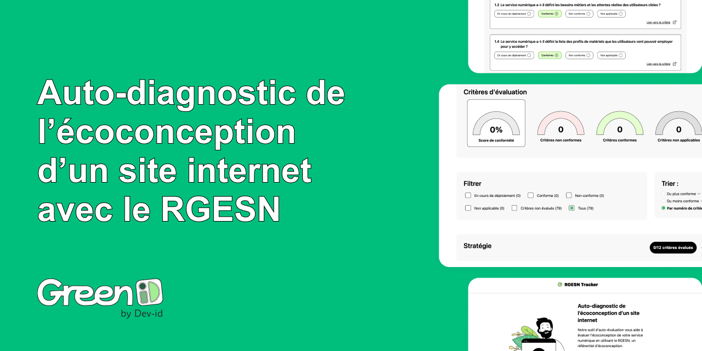

<p align="center">
  <br/>
  <a href="https://rgesn.meexr.fr">RGESN Tracker</a> est une plateforme web permettant &mdash;
  <br/>
  d'effectuer un auto-diagnostic de l'éco-conception d'un site internet avec le RGESN.
  <br/><br/>
</p>

# rgesntracker
A simple tool for tracking and displaying the current status of the [RGESN](https://ecoresponsable.numerique.gouv.fr/publications/referentiel-general-ecoconception/) network.

⭐ Star us on GitHub — it motivates us a lot!

## Usage

```bash
# Install dependencies
$ npm install

# Run the program
$ npm run start
```

## License
This project is licensed under the MIT License. See the [LICENSE](LICENSE) file for details.

## Credits
* [RGESN](https://ecoresponsable.numerique.gouv.fr/publications/referentiel-general-ecoconception/) for providing the data
* [Samuel Trouchaud, Daniel Doughan] For the front-end Development 
* [Daniel Doughan] For the back-end Development 
* [Romane Dedieu] For the Design

> TODO : Improve responsive experience
> TODO : Improve PDF rendering
